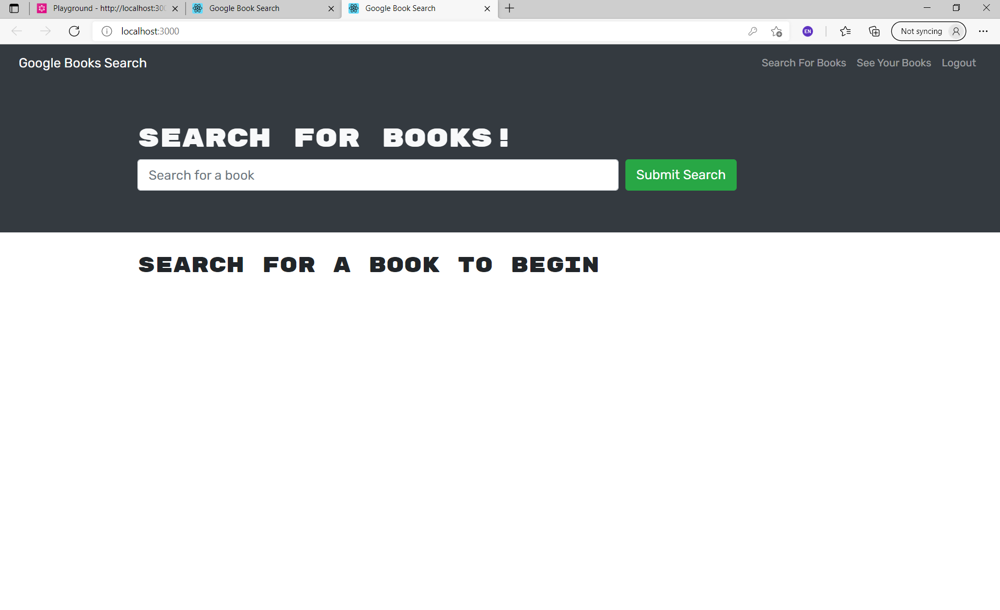
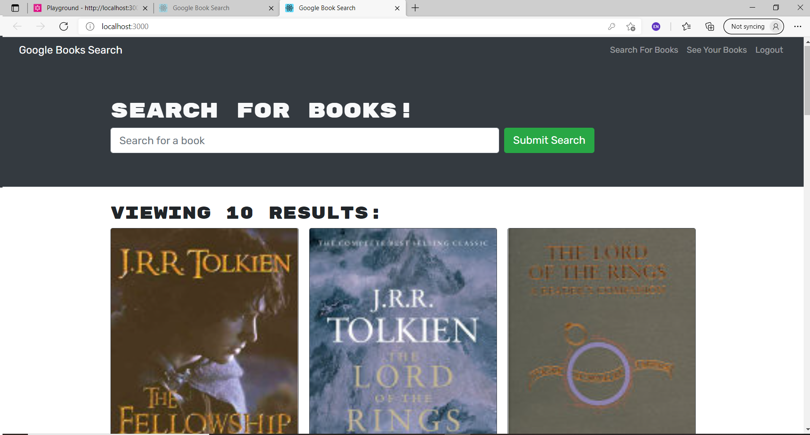
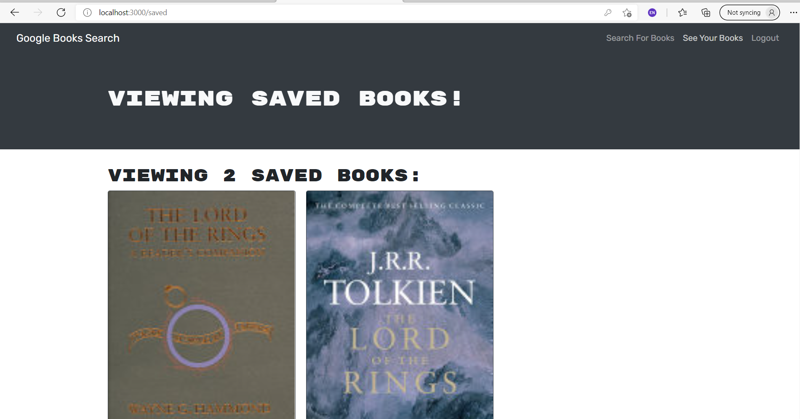

# Google Books - MERN Stack

## Author: WellAndGood

# Table of Contents
* [Overview](#overview)
* [Features](#features)
* [Files](#files)
* [Appearance](#appearance)
* [Contributors](#contributors)
* [License](#license)

## Overview

This document describes the components of a Google Books application built upon the MERN-stack.  
This website is meant to demonstrate knowledge and competency in the following:

- MongoDB, Mongo.js, and Mongoose,
- Node and Express,
- GraphQL (TypeDefs and Resolvers),
- JSON Web Tokens (JWT),
- React.js,
- Deployment with Heroku

# Features
The following are the general functions involved in this stack:
- Front-end (`Client` folder):
    - `SignupForm.js`: uses `CREATE_USER` mutation through `../utils/mutations` instead of `{ loginUser }` from `utils/API`. Changed the `createUser` function by using a mutation.
    - `LoginForm.js`: uses `LOGIN` mutation through `../utils/mutations` instead of `{ loginUser }` from `utils/API`. Changed the `loginUser` function by using a mutation.
    - `SavedBooks.js`: uses `REMOVE_BOOK` mutation and `GET_ME` query to allow the user to remove a book from the `SavedBooks` components.
    - `SearchBooks.js`: uses `SAVE_BOOK` mutation to allow the user to add a book to 
    - `mutations.js`: contains UPPER_CASE-style mutations, which will later be used by the components and pages.
    - `queries.js`: contains UPPER_CASE-style queries, which will later be used by the components and pages.
    - `App.js`: 

- Back-end (`Server` folder):
    - `Schemas/typeDefs.js`: created types `User`, `Book`, `BookInput`, `Auth`, with `Query` and `Mutation`.
    - `Schemas/resolvers.js`: resolved queries `users` and `me` with mutations `createUser`, `saveBook`, `removeBook`, and `login`.
    - `server.js`: updated file to accept GraphQL and middleware.

# Appearance 

You can access the `.git` files at:
https://github.com/WellAndGood/MongoDBExerciseApp.git

The deployed application can be found here:
https://github.com/WellAndGood/GoogleBooksMERN.git

Once initialized, the page will look like this:

Regardless of your login status, submitting to the search bar will load a page that looks like this:

Only if you are logged in, you can click the `See Your Books` page, which displays every book that you've saved. That page looks like this:

## Contributors
Daniel Pisani (WellAndGood)

# Contact
* GitHub account: WellAndGood

## License
This project is licensed under:

### MIT License

Copyright (c) 2021 Daniel Pisani (WellAndGood) 

Permission is hereby granted, free of charge, to any person obtaining a copy of this software and associated documentation files (the "Software"), to deal in the Software without restriction, including without limitation the rights to use, copy, modify, merge, publish, distribute, sublicense, and/or sell copies of the Software, and to permit persons to whom the Software is furnished to do so, subject to the following conditions:

The above copyright notice and this permission notice shall be included in all copies or substantial portions of the Software.

THE SOFTWARE IS PROVIDED "AS IS", WITHOUT WARRANTY OF ANY KIND, EXPRESS OR IMPLIED, INCLUDING BUT NOT LIMITED TO THE WARRANTIES OF MERCHANTABILITY, FITNESS FOR A PARTICULAR PURPOSE AND NONINFRINGEMENT. IN NO EVENT SHALL THE AUTHORS OR COPYRIGHT HOLDERS BE LIABLE FOR ANY CLAIM, DAMAGES OR OTHER LIABILITY, WHETHER IN AN ACTION OF CONTRACT, TORT OR OTHERWISE, ARISING FROM, OUT OF OR IN CONNECTION WITH THE SOFTWARE OR THE USE OR OTHER DEALINGS IN THE SOFTWARE.